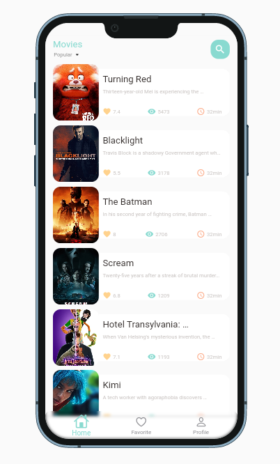
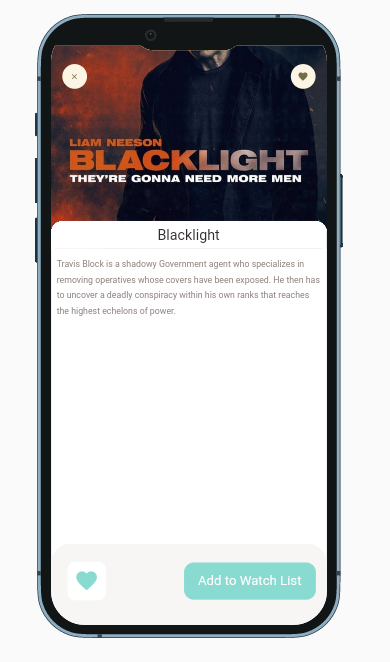
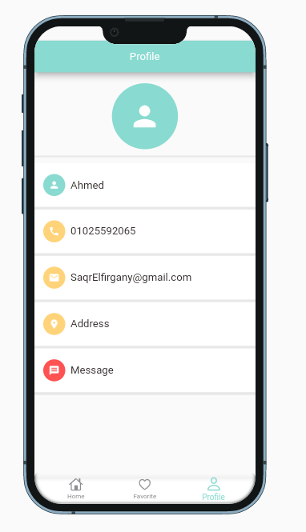

# Basic MoviesDB Client Flutter App

#### Packages:
- get
- flutter_screenutil
- persistent_bottom_nav_bar
- url_launcher
- cached_network_image
- equatable
- carousel_slider
- device_preview
- shared_preferences
# Screenshots

